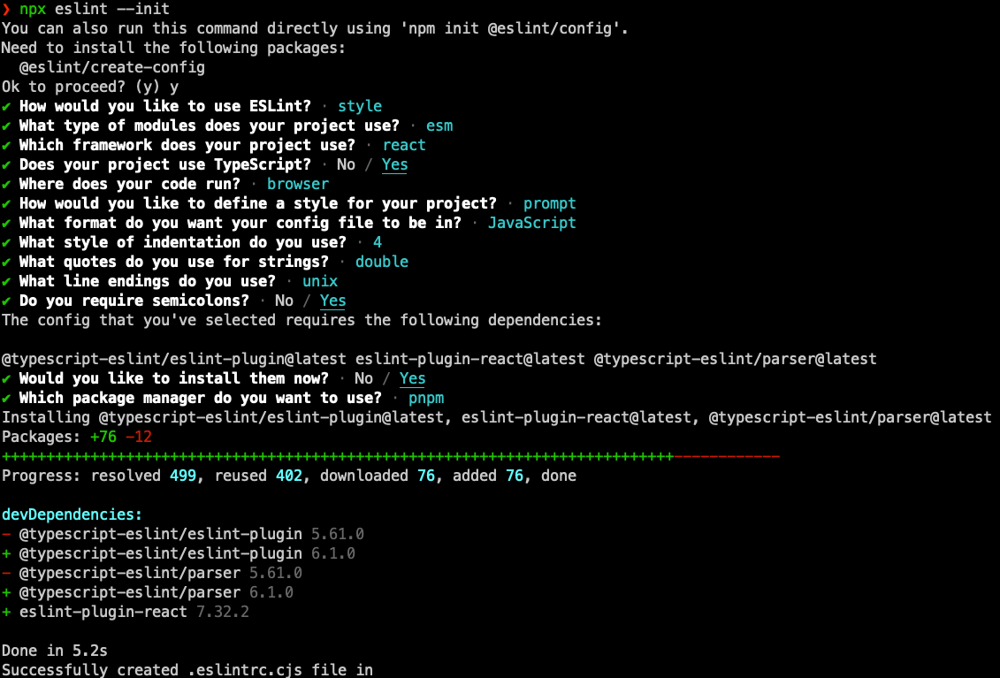
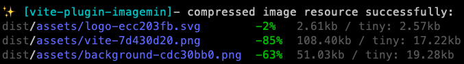
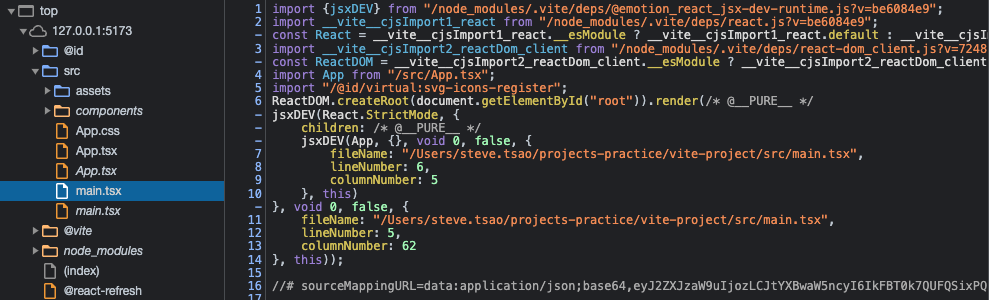
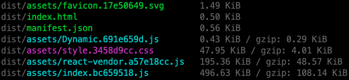
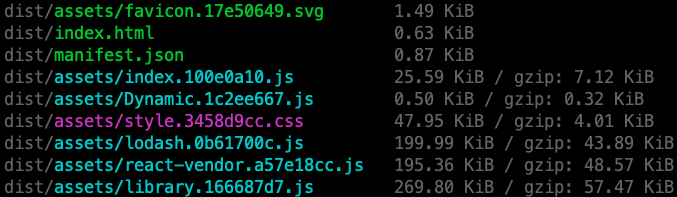
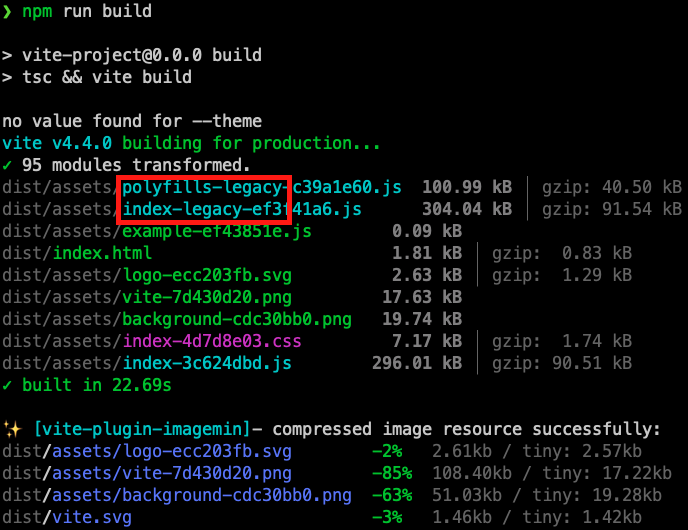

# head first vite (vite react)

## reference

<https://github.com/sanyuan0704/juejin-book-vite>

## node env

```shell
>= 16.14.0
```

環境搭建

```shell
npm i -g pnpm
```

項目初始化

```shell
pnpm create vite
```

## css 預處理器

```shell
pnpm i -D sass
```

## PostCSS

```shell
pnpm i -D autoprefixer
```

* Vite 配置文件(vite.config.ts)中如果有 PostCSS 配置的情况下会覆盖掉 postcss.config.js 的内容!
* 搭配 tailwindcss 使用，看下方 tailwindcss 設定

## CSS In JS

```shell

pnpm i -D babel-plugin-styled-components @emotion/babel-plugin @emotion/react
```

```javascript
// vite.config.ts
import {
    defineConfig
} from 'vite'
import react from '@vitejs/plugin-react'

// https://vitejs.dev/config/
export default defineConfig({
    plugins: [
        react({
            babel: {
                // 加入 babel 插件
                // 以下插件包都需要提前安装
                // 当然，通过这个配置你也可以添加其它的 Babel 插件
                plugins: [
                    // 适配 styled-component
                    "babel-plugin-styled-components"
                    // 适配 emotion
                    "@emotion/babel-plugin"
                ]
            },
            // 注意: 对于 emotion，需要单独加上这个配置
            // 通过 `@emotion/react` 包编译 emotion 中的特殊 jsx 语法
            jsxImportSource: "@emotion/react"
        })
    ]
})
```

## styled components

```shell
pnpm i -D styled-components
```

```shell
pnpm i -D @types/styled-components
```

```shell
pnpm i -D babel-plugin-styled-components
```

## emotion

```shell
pnpm i -D @emotion/react @emotion/styled @emotion/css
```

```shell
pnpm i -D @emotion/babel-plugin
```

```javascript
// src/vite-env.d.ts

/// <reference types="vite/client" />
/// <reference types="@emotion/react/types/css-prop" />
```

## tailwindcss

```shell
pnpm i -D tailwindcss postcss autoprefixer
```

```shell
npx tailwindcss init
```

```javascript
// tailwind.config.js
export default {
    content: ["./index.html", "./src/**/*.{vue,js,ts,jsx,tsx}"],
    theme: {
        extend: {},
    },
    plugins: [],
};
```

```javascript
// postcss.config.js
import autoprefixer from 'autoprefixer';
import tailwindcss from 'tailwindcss';
import tailwindConfig from './tailwind.config.js';
export default {
    plugins: [
        tailwindcss(tailwindConfig),
        autoprefixer({
            overrideBrowserslist: ['safari >= 6', 'ff >= 10']
        })
    ]
};

// vite.config.js
import postcssConfig from './postcss.config.js';

export default defineConfig({
    // xxx
    css: {
        postcss: postcssConfig
    }
    // xxx
})
```

### 入口 css

```css
@tailwind base;
@tailwind components;
@tailwind utilities;
```

## eslint

```shell
pnpm i -D eslint
```



```shell
pnpm i eslint-plugin-react@latest @typescript-eslint/eslint-plugin@latest @typescript-eslint/parser@latest -D
```

### 🧲 for webstorm(不要裝到最新版)

```javascript
"@typescript-eslint/eslint-plugin": "^5.62.0",
"@typescript-eslint/parser": "^5.62.0",
```

### .eslintrc.cjs

* parser 解析器

```javascript
    parser: '@typescript-eslint/parser'
```

* parserOptions 解析器選項
  + ecmaVersion: latest
  + sourceType: module (使用 ES Module)
  + ecmaFeatures: 物件，jsx: true (使用 JSX)

```javascript
parserOptions: {
    ecmaFeatures: {
        jsx: true
    },
    ecmaVersion: "latest",
    sourceType: "module"
},
```

* rules 規則

```javascript
rules: {
    "規則名": "規則配置",
    "prettier/prettier": "error",
    // xxx
    "規則名": ["規則 ID", "規則配置"],
    indent: ["error", 2],
},
```

* 規則 ID
  + "off" 或 0 - 關閉規則
  + "warn" 或 1 - 開啟規則，使用警告級別的錯誤：warn (不會使得程式停止運行)
  + "error" 或 2 - 開啟規則，使用錯誤級別的錯誤：error (當被觸發的時候，程式會停止運行)

```javascript
rules: {
    "prettier/prettier": "error",
    indent: ["error", 2],
    "linebreak-style": ["error", "unix"],
    quotes: ["error", "double"],
    semi: ["error", "always"],
    "react/no-unknown-property": ["error", {
        ignore: ["css"]
    }]
},
```

* Disallow missing React when using JSX (react/react-in-jsx-scope)

<https://github.com/jsx-eslint/eslint-plugin-react/blob/master/docs/rules/react-in-jsx-scope.md>

> If you are using the new JSX transform from React 17, you should disable this rule by extending react/jsx-runtime in your eslint config (add "plugin:react/jsx-runtime" to "extends").

### plugins

```javascript
// .eslintrc.js
module.exports = {
    // 添加 TS 规则，可省略`eslint-plugin`
    plugins: ['@typescript-eslint']
}
```

> plugins 添加後，預設沒有開啟任何規則，需要手動開啟

## Prettier

```shell
echo {} > .prettierrc.json
```

```shell
pnpm i eslint-config-prettier eslint-plugin-prettier -D
```

* eslint-config-prettier: 覆盖掉 eslint 中與 prettier 衝突的規則，<https://github.com/prettier/eslint-config-prettier#installation>
* eslint-plugin-prettier: 讓 prettier 接管 `eslint --fix` 的功能，
  <https://github.com/prettier/eslint-plugin-prettier>

### eslint 接入 prettier 範例

```javascript
// .eslintrc.js
module.exports = {
    env: {
        browser: true,
        es2021: true
    },
    extends: [
        "eslint:recommended",
        "plugin:react/recommended",
        "plugin:@typescript-eslint/recommended",
        // 1. 接入 prettier 的规则
        "prettier",
        "plugin:prettier/recommended"
    ],
    parser: "@typescript-eslint/parser",
    parserOptions: {
        ecmaFeatures: {
            jsx: true
        },
        ecmaVersion: "latest",
        sourceType: "module"
    },
    // 2. 加入 prettier 的 eslint 插件
    plugins: ["react", "@typescript-eslint", "prettier"],
    rules: {
        // 3. 注意要加上这一句，开启 prettier 自动修复的功能
        "prettier/prettier": "error",
        quotes: ["error", "single"],
        semi: ["error", "always"],
        "react/react-in-jsx-scope": "off"
    }
};
```

### ESLint + Prettier

```javascript
{
    "scripts": {
        // 省略已有 script
        "lint:script": "eslint --ext .js,.jsx,.ts,.tsx --fix --quiet ./src",
    }
}
```

```shell
pnpm run lint:script
```

### Warning: React version not specified in eslint-plugin-react settings

> Warning: React version not specified in eslint-plugin-react settings. See <https://github.com/jsx-eslint/eslint-plugin-react#configuration> .

* 在github issues <https://github.com/yannickcr/eslint-plugin-react/issues/1955>和<https://juejin.im/post/5c90da695188252daa18ec21>中找到了答案
* 在eslintrc.cjs 中新增 settings

```javascript
settings: {
    react: {
        version: "detect"
    }
}
```

### 開發時通過 vite plugin 的方式進行 eslint 檢查，檢查結果顯示在 terminal

```shell
pnpm i -D vite-plugin-eslint
```

```javascript
// vite.config.js
import viteEslint from 'vite-plugin-eslint';

export default defineConfig({
    // xxx
    plugins: [viteEslint()]
    // xxx
})
```

## Stylelint

```shell
pnpm i stylelint stylelint-prettier stylelint-config-prettier stylelint-config-recess-order stylelint-config-standard stylelint-config-standard-scss -D
```

```shell
echo {} > .stylelintrc.json
```

```json
// .stylelintrc.json
{
  "plugins": ["stylelint-prettier"],
  "extends": [
    "stylelint-config-standard",
    "stylelint-config-standard-scss",
    "stylelint-config-recess-order",
    "stylelint-config-prettier",
    "stylelint-prettier/recommended"
  ],
  "rules": {
    "prettier/prettier": true,
    "at-rule-no-unknown": null,
    "scss/at-rule-no-unknown": [
        true,
        {
            "ignoreAtRules": ["tailwind"]
        }
    ]
  }
}
```

### for tailwindcss

```json
  "rules": {
    // xxx
    "at-rule-no-unknown": null,
    "scss/at-rule-no-unknown": [
      true,
      {
        "ignoreAtRules": ["tailwind"]
      }
    ]
    // xxx
  }
```

### scripts 整合 stylelint

```json
{
  "scripts": {
    // 整合 lint 命令
    "lint": "npm run lint:script && npm run lint:style",
    // stylelint 命令
    "lint:style": "stylelint --fix \"src/**/*.{css,scss}\""
  }
}

```

### 開發時進行 stylelint 檢查，檢查結果顯示在 terminal

```shell
pnpm i vite-plugin-stylelint -D
```

```json
import viteStylelint from '@amatlash/vite-plugin-stylelint';
// 注意: Vite 3.x 以及以后的版本需要引入 vite-plugin-stylelint

// 具体配置
{
  plugins: [
    // 省略其它插件
    viteStylelint({
      // 对某些文件排除检查
      exclude: /windicss|node_modules/
    }),
  ]
}
```

## Husky + lint-staged

```shell
pnpm i husky -D
```

### steps

* 初始化 Husky: npx husky install，并将 husky install作为项目启动前脚本

```javascript
{
    "scripts": {

        // 会在安装 npm 依赖后自动执行
        "prepare": "husky install"

    }
}
```

* 添加 Husky 钩子，在终端执行如下命令:

```shell
npx husky add .husky/pre-commit "npm run lint"
```

### lint-staged (只對 staged files 執行 lint)

```shell
pnpm i -D lint-staged
```

package.json 設定

```javascript
{
    // package.json
    "lint-staged": {
        "**/*.{js,jsx,tsx,ts}": [
            "npm run lint:script",
            "git add ."
        ],
        "**/*.{scss}": [
            "npm run lint:style",
            "git add ."
        ]
    }
}
```

到 `.husky/pre-commit` 脚本中，修改原本的 `npm run lint`

```sh
# .husky/pre-commit
npx --no -- lint-staged
```

## commitlint (commit message 規範)

link: <https://commitlint.js.org/#/>

### install

```shell
pnpm i commitlint @commitlint/cli @commitlint/config-conventional -D
```

### configure

```shell
echo "module.exports = {extends: ['@commitlint/config-conventional']}" > commitlint.config.js
```

### commit message 結構

分2個部分

```JS
// type 指提交的类型
// subject 指提交的摘要信息
<
type >: < subject >
```

常用 type

* feat: 新功能
* fix: 修復 bug
* chore: 不影響功能的修改
* docs: 文件修改
* perf: 性能優化
* refactor: 重構代碼
* test: 測試代碼

### set Husky hook

```shell
npx husky add .husky/commit-msg "npx --no-install commitlint -e $HUSKY_GIT_PARAMS"
```

### commitlint cjs 報錯

<details>
  <summary>錯誤訊息</summary>

```shell
node@10.9.1_@types+node@20.4.2_typescript@5.0.2/node_modules/ts-node/dist/index.js:851
            return old(m, filename);
                   ^
Error [ERR_REQUIRE_ESM]: require() of ES Module /Volumes/data/Projects/head-first-vite/commitlint.config.js from /Volumes/data/Projects/head-first-vite/node_modules/.pnpm/cosmiconfig@8.2.0/node_modules/cosmiconfig/dist/loaders.js not supported.
commitlint.config.js is treated as an ES module file as it is a .js file whose nearest parent package.json contains "type": "module" which declares all .js files in that package scope as ES modules.
Instead rename commitlint.config.js to end in .cjs, change the requiring code to use dynamic import() which is available in all CommonJS modules, or change "type": "module" to "type": "commonjs" in /Volumes/data/Projects/head-first-vite/package.json to treat all .js files as CommonJS (using .mjs for all ES modules instead).

    at Object.require.extensions.<computed> [as .js] (/Volumes/data/Projects/head-first-vite/node_modules/.pnpm/ts-node@10.9.1_@types+node@20.4.2_typescript@5.0.2/node_modules/ts-node/dist/index.js:851:20)
    at module.exports (/Volumes/data/Projects/head-first-vite/node_modules/.pnpm/import-fresh@3.3.0/node_modules/import-fresh/index.js:32:59)
    at loadJsSync (/Volumes/data/Projects/head-first-vite/node_modules/.pnpm/cosmiconfig@8.2.0/node_modules/cosmiconfig/dist/loaders.js:18:18)
    at loadJs (/Volumes/data/Projects/head-first-vite/node_modules/.pnpm/cosmiconfig@8.2.0/node_modules/cosmiconfig/dist/loaders.js:29:12)
    at async Explorer.loadFileContent (/Volumes/data/Projects/head-first-vite/node_modules/.pnpm/cosmiconfig@8.2.0/node_modules/cosmiconfig/dist/Explorer.js:90:14)
    at async Explorer.createCosmiconfigResult (/Volumes/data/Projects/head-first-vite/node_modules/.pnpm/cosmiconfig@8.2.0/node_modules/cosmiconfig/dist/Explorer.js:98:25)
    at async Explorer.loadSearchPlace (/Volumes/data/Projects/head-first-vite/node_modules/.pnpm/cosmiconfig@8.2.0/node_modules/cosmiconfig/dist/Explorer.js:75:12)
    at async Explorer.searchDirectory (/Volumes/data/Projects/head-first-vite/node_modules/.pnpm/cosmiconfig@8.2.0/node_modules/cosmiconfig/dist/Explorer.js:60:27)
    at async run (/Volumes/data/Projects/head-first-vite/node_modules/.pnpm/cosmiconfig@8.2.0/node_modules/cosmiconfig/dist/Explorer.js:41:22)
    at async cacheWrapper (/Volumes/data/Projects/head-first-vite/node_modules/.pnpm/cosmiconfig@8.2.0/node_modules/cosmiconfig/dist/cacheWrapper.js:16:18)
    at async Explorer.search (/Volumes/data/Projects/head-first-vite/node_modules/.pnpm/cosmiconfig@8.2.0/node_modules/cosmiconfig/dist/Explorer.js:34:12)
    at async loadConfig (/Volumes/data/Projects/head-first-vite/node_modules/.pnpm/@commitlint+load@17.6.7/node_modules/@commitlint/load/lib/utils/load-config.js:40:19)
    at async load (/Volumes/data/Projects/head-first-vite/node_modules/.pnpm/@commitlint+load@17.6.7/node_modules/@commitlint/load/lib/load.js:19:20)
    at async main (/Volumes/data/Projects/head-first-vite/node_modules/.pnpm/@commitlint+cli@17.6.7/node_modules/@commitlint/cli/lib/cli.js:194:20) {
  code: 'ERR_REQUIRE_ESM',
  filepath: '/Volumes/data/Projects/head-first-vite/commitlint.config.js'
}
husky - commit-msg hook exited with code 1 (error)
```

</details>

* 原因: 由於在commitlint.config.js檔案中使用了ES模塊的語法，而該檔案的父級package.json中聲明了"type": "module"，將所有.js文件視為ES模塊。然而，在引用這個commitlint.config.js的地方（在/head-first-vite/node_modules/.pnpm/cosmiconfig@8.2.0/node_modules/cosmiconfig/dist/loaders.js）使用了CommonJS的require語法，這導致了錯誤。
* 將commitlint.config.js重新命名為commitlint.config.cjs：
將.js後綴改為.cjs，這樣Node.js會將該文件視為CommonJS模塊，不再報錯。

## static resources

### alias

```javascript
// vite.config.ts
import path from 'path';

{
    resolve: {
        // 别名配置
        alias: {
            '@assets': path.join(__dirname, 'src/assets')
        }
    }
}
```

### SVG

* Vue2: [vite-plugin-vue2-svg](https://github.com/pakholeung37/vite-plugin-vue2-svg)
* Vue3: [vite-svg-loader](https://github.com/jpkleemans/vite-svg-loader)
* React: [vite-plugin-svgr](https://github.com/pd4d10/vite-plugin-svgr)

```shell
pnpm i vite-plugin-svgr -D
```

```javascript
// vite.config.ts
import svgr from 'vite-plugin-svgr';

{
    plugins: [
        // 其它插件省略
        svgr()
    ]
}
```

tsconfig.json也要設定，否則會有類型錯誤

```javascript
// tsconfig.json
{
    "compilerOptions": {
        // 省略其它配置
        "types": ["vite-plugin-svgr/client"]
    }
}
```

### JSON

```javascript
// vite.config.ts

{
    json: {

        stringify: true

    }
}
```

> 這樣會將 JSON 的內容解析為export default JSON.parse("xxx")，這樣會失去按名導出的能力，不過在 JSON 數據量比較大的時候，可以優化解析性能。

```javascript
import packageObj from "../../../package.json";
console.log("package", packageObj.version);
```

### web worker script

```javascript
// Header/example.js
const start = () => {
    let count = 0;
    setInterval(() => {
        // 给主线程传值
        postMessage(++count);
    }, 2000);
};

start();
```

在 Header 組件中引入，結尾加上 `?worker` 後綴

```javascript
import Worker from './example.js?worker';
// 1. 初始化 Worker 实例
const worker = new Worker();
// 2. 主线程监听 worker 的信息
worker.addEventListener('message', (e) => {
    console.log(e);
});
```

### 生產環境處理

* `pnpm run dev`: process.env. NODE_ENV = development
* `pnpm run build`: process.env. NODE_ENV = production

### 圖片壓縮

```shell
pnpm i vite-plugin-imagemin -D
```

```javascript
//vite.config.ts
import viteImagemin from 'vite-plugin-imagemin';

{
    plugins: [
        // 忽略前面的插件
        viteImagemin({
            // 无损压缩配置，无损压缩下图片质量不会变差
            optipng: {
                optimizationLevel: 7
            },
            // 有损压缩配置，有损压缩下图片质量可能会变差
            pngquant: {
                quality: [0.8, 0.9],
            },
            // svg 优化
            svgo: {
                plugins: [{
                        name: 'removeViewBox'
                    },
                    {
                        name: 'removeEmptyAttrs',
                        active: false
                    }
                ]
            }
        })
    ]
}
```

```shell
pnpm run build
```



### 減少 svg 請求

```shell
pnpm i vite-plugin-svg-icons -D
```

```javascript
// vite.config.ts
import {
    createSvgIconsPlugin
} from 'vite-plugin-svg-icons';

{
    plugins: [
        // 省略其它插件
        createSvgIconsPlugin({
            iconDirs: [path.join(__dirname, 'src/assets/icons')]
        })
    ]
}
```

#### 在 src/components目錄下新增SvgIcon组件

```JSX
// SvgIcon/index.tsx
export interface SvgIconProps {
  name: string | undefined;
  prefix?: string;
  color?: string;
  [key: string]: string | undefined;
}

export default function SvgIcon({
  name,
  prefix = "icon",
  color = "#333",
  ...props
}: SvgIconProps) {
  const symbolId = `#${prefix}-${name}`;

  return (
    <svg {...props} aria-hidden="true">
      <use href={symbolId} fill={color} />
    </svg>
  );
}
```

#### 回到 Header

```JSX
import SvgIcon from "../SvgIcon";

interface Icon {
  default: string;
}
const icons = import.meta.glob("../../assets/icons/logo-*.svg", {
  eager: true
});
const iconUrls = Object.values<Icon>(icons as { [s: string]: Icon }).map(
  (mod) => {
    // 如 ../../assets/icons/logo-1.svg -> logo-1
    console.log("mod", mod);
    // 確保 mod.default 的值存在並且符合預期的格式
    if (mod.default && typeof mod.default === "string") {
      const fileName = mod.default.split("/").pop();
      if (fileName) {
        const [svgName] = fileName.split(".");
        console.log("svgName", svgName);
        return svgName;
      } else {
        console.warn("Invalid fileName format:", mod.default);
        // return someDefaultValue; // 可選：如果有預設值的話，可以返回一個預設值
      }
    } else {
      console.warn("Invalid mod.default value:", mod.default);
      // return someDefaultValue; // 可選：如果有預設值的話，可以返回一個預設值
    }
  }
);

```

#### src/main.tsx

```javascript
import 'virtual:svg-icons-register';
```

## 預構建

### 自動開啟

第一次啟動專案時，預構建產物目錄
 `/Users/steve.tsao/projects-practice/vite-project/node_modules/.vite`



## code splitting

### manualChunks

* 可以配置物件或函式

#### 物件

```javascript
// vite.config.ts
{
    build: {
        rollupOptions: {
            output: {
                // manualChunks 配置
                manualChunks: {
                    // 将 React 相关库打包成单独的 chunk 中
                    'react-vendor': ['react', 'react-dom'],
                    // 将 Lodash 库的代码单独打包
                    'lodash': ['lodash-es'],
                    // 将组件库的代码打包
                    'library': ['antd', '@arco-design/web-react'],
                },
            },
        }
    },
}
```

* before



* after，把 lodash 和 library 打包成獨立的 chunk



#### 函式

容易造成循環引用，需要再處理

## 語法降級，polyfill

```shell
pnpm i @babel/cli @babel/core @babel/preset-env
```

```shell
pnpm i @babel/cli @babel/core @babel/plugin-transform-runtime @babel/preset-env @babel/runtime @babel/runtime-corejs3 core-js
```

* target 配置：<https://github.com/browserslist/browserslist>
* 對應瀏覽器列表：<https://browserslist.dev/?q=bGFzdCAyIHZlcnNpb25z>

### 💡vite 語法降級 與 polyfill 注入

```shell
pnpm i @vitejs/plugin-legacy -D
```

```javascript
// vite.config.ts
import legacy from '@vitejs/plugin-legacy';
import {
    defineConfig
} from 'vite'

export default defineConfig({
    plugins: [
        // 省略其它插件
        legacy({
            // 设置目标浏览器，browserslist 配置语法
            targets: ['ie >= 11'],
        })
    ]
})
```

* build 訊息



## SSR

### CSR

* 首頁加載速較慢
* SEO 不友好

### SSR 如何解決

* 服務端生成完整的 HTML，再返回給客戶端，瀏覽器不依賴 js 渲染頁面

### hydrate

* SSR 只能生成頁面內容和結構，無法完成事件綁定。需要瀏覽器執行 CSR 的 js 代碼，才能完成事件綁定。
